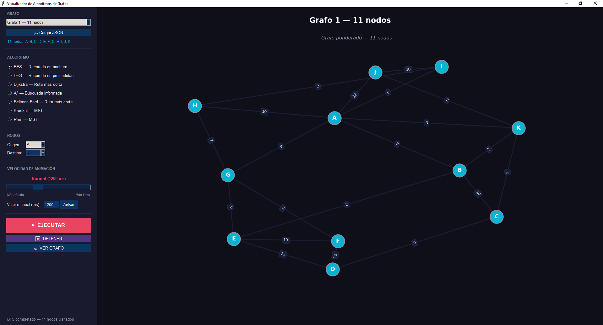
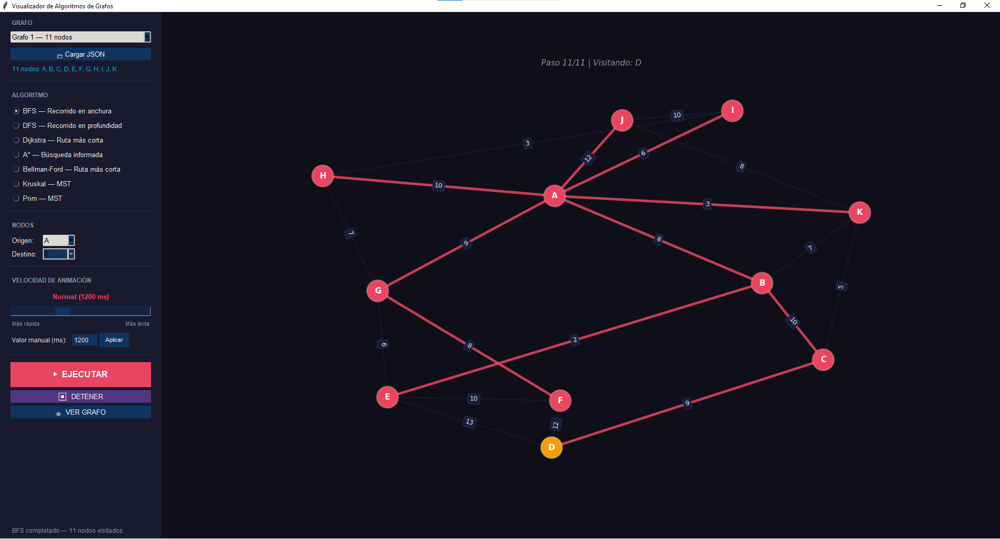
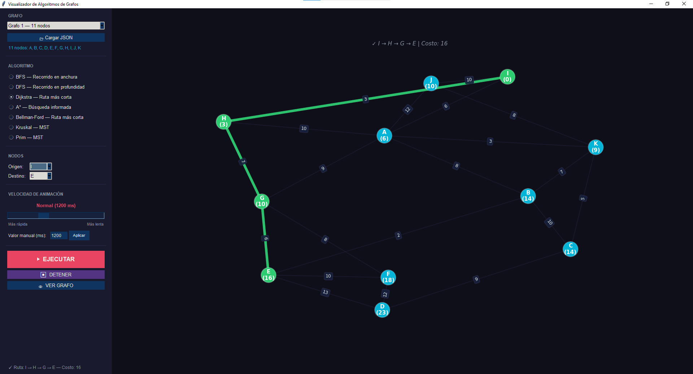
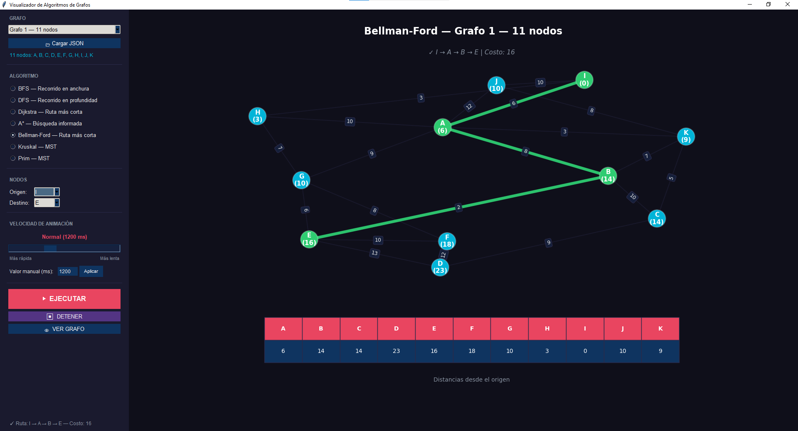

# 🧠 Graph Algorithm Visualizer — Visualizador de Algoritmos de Grafos

<div align="center">


**Aplicación de escritorio para visualizar paso a paso la ejecución de 7 algoritmos fundamentales sobre grafos ponderados no dirigidos**

Desarrollado como parte del Servicio Social en la **Universidad Autónoma de Querétaro (UAQ)**  
Facultad de Informática

---

### 👨‍💻 Desarrollador
**Jafet Ibarra**  
Prestador de Servicio Social - UAQ

---

</div>

## 📋 Tabla de Contenidos

- [Descripción](#-descripción)
- [Características](#-características)
- [Capturas de Pantalla](#-capturas-de-pantalla)
- [Requisitos del Sistema](#-requisitos-del-sistema)
- [Instalación](#-instalación)
- [Estructura del Proyecto](#-estructura-del-proyecto)
- [Manual de Usuario](#-manual-de-usuario)
  - [Interfaz Gráfica](#1-interfaz-gráfica)
  - [Selección de Grafo](#2-selección-de-grafo)
  - [Carga de Grafos desde JSON](#3-carga-de-grafos-desde-json)
  - [Ejecución de Algoritmos](#4-ejecución-de-algoritmos)
  - [Controles de Animación](#5-controles-de-animación)
- [Algoritmos Implementados](#-algoritmos-implementados)
  - [BFS — Búsqueda en Anchura](#41-bfs--búsqueda-en-anchura)
  - [DFS — Búsqueda en Profundidad](#42-dfs--búsqueda-en-profundidad)
  - [Dijkstra — Ruta Más Corta](#43-dijkstra--camino-más-corto)
  - [A* — Búsqueda Informada](#44-a--búsqueda-informada)
  - [Bellman-Ford — Caminos Más Cortos](#45-bellman-ford--caminos-más-cortos)
  - [Kruskal — MST](#46-kruskal--árbol-de-expansión-mínima)
  - [Prim — MST](#47-prim--árbol-de-expansión-mínima)
- [Complejidad Computacional](#-complejidad-computacional)
- [Documentación Técnica](#-documentación-técnica)
  - [Arquitectura del Sistema](#arquitectura-del-sistema)
  - [Componentes Principales](#componentes-principales)
  - [Estructuras de Datos](#estructuras-de-datos)
  - [Sistema de Tolerancia a Fallos](#sistema-de-tolerancia-a-fallos)
- [Matrices de Ejemplo](#-matrices-de-ejemplo)
- [Extensibilidad](#-extensibilidad)
- [Licencia](#-licencia)

---

## 🎯 Descripción

El **Visualizador de Algoritmos de Grafos** es una aplicación de escritorio desarrollada en Python que permite observar, paso a paso, la ejecución de los principales algoritmos sobre grafos ponderados no dirigidos. Su propósito es servir como herramienta educativa y de análisis, ofreciendo animaciones interactivas que ilustran cómo cada algoritmo toma decisiones en tiempo real.

La aplicación implementa **7 algoritmos fundamentales** organizados en tres categorías:

| Categoría | Algoritmos |
|-----------|-----------|
|  **Recorridos** | BFS, DFS |
|  **Caminos más cortos** | Dijkstra, A*, Bellman-Ford |
|  **Árboles de expansión mínima** | Kruskal, Prim |

Cada algoritmo se visualiza con colores diferenciados para nodos visitados, nodo actual, aristas del camino y aristas evaluadas. El sistema cuenta con una interfaz gráfica construida con Tkinter que integra un canvas de Matplotlib para renderizar las animaciones directamente dentro de la ventana principal.

Este proyecto fue desarrollado como parte de las actividades de Servicio Social en la **Facultad de Informática de la Universidad Autónoma de Querétaro (UAQ)**, con el objetivo de proporcionar una herramienta educativa de calidad para la comunidad académica.

### 🎓 Contexto Académico

- **Institución**: Universidad Autónoma de Querétaro (UAQ)
- **Facultad**: Facultad de Informática
- **Propósito**: Herramienta educativa para el estudio de Teoría de Grafos
- **Modalidad**: Proyecto de Servicio Social

## ✨ Características

### 🎨 Interfaz Visual
- **Tema oscuro profesional** con paleta de colores cuidadosamente seleccionada
- **Animaciones paso a paso** con velocidad ajustable (200ms — 3000ms)
- **Canvas de Matplotlib** integrado directamente en la ventana de Tkinter
- **Barra de estado** con información en tiempo real del progreso del algoritmo

### 🧮 Algoritmos
- **7 algoritmos** implementados con visualización independiente
- **Arquitectura modular**: cada algoritmo en su propio archivo — si uno falla, los demás siguen funcionando
- **Código documentado** con pseudocódigo y explicaciones en español
- **Colores semánticos**: naranja = actual, rojo = visitado, verde = camino solución, punteado = evaluando

### 📊 Visualización de Datos
- **Nodos con etiquetas** y distancias acumuladas en tiempo real
- **Aristas con pesos** siempre visibles durante la animación
- **Tabla de distancias** especial para Bellman-Ford (panel inferior)
- **Frame final** que resalta el camino óptimo en verde con costo total

### 📂 Gestión de Grafos
- **2 grafos precargados** para usar inmediatamente
- **Carga desde JSON** con 3 formatos soportados (matriz + nombres, solo matriz, lista de aristas)
- **Validación automática**: simetría forzada, verificación de matriz cuadrada
- **Grafos personalizados** se agregan al dropdown durante la sesión

### ⚡ Controles
- **Selector de velocidad** con slider + entrada manual
- **Controles de nodos** inteligentes: se habilitan/deshabilitan según el algoritmo
- **Botones de acción**: Ejecutar, Detener, Ver Grafo
- **Cierre limpio** de animaciones y recursos al salir

---

## 📸 Capturas de Pantalla

### 🖼️ Vista Principal
<div align="center">
  
  <p><em>Interfaz principal mostrando un grafo de 11 nodos con panel de controles</em></p>
</div>

### 🔄 BFS en Ejecución
<div align="center">
  
  <p><em>BFS explorando nivel por nivel — nodo actual en naranja, visitados en rojo</em></p>
</div>

### 🛤️ Dijkstra — Camino Encontrado
<div align="center">
  
  <p><em>Dijkstra finalizando: camino óptimo resaltado en verde con distancias acumuladas</em></p>
</div>

### 📊 Bellman-Ford con Tabla de Distancias
<div align="center">
  
  <p><em>Bellman-Ford mostrando tabla de distancias y relajación de arista en tiempo real</em></p>
</div>

 

---

## 💻 Requisitos del Sistema

### Software Requerido
- **Python**: 3.8 o superior
- **Sistema Operativo**: Windows, macOS o Linux
- **Resolución mínima**: 1280 × 820 píxeles

### Bibliotecas Python

| Librería | Versión Recomendada | Propósito |
|----------|-------------------|-----------|
| NumPy | ≥ 1.21 | Manejo de matrices de adyacencia |
| NetworkX | ≥ 2.6 | Representación y layout de grafos |
| Matplotlib | ≥ 3.5 | Renderizado y animaciones |
| Tkinter | ≥ 8.6 | Interfaz gráfica (incluido con Python) |

---

## 🚀 Instalación

### Paso 1: Clonar o Descargar el Proyecto

```bash
git clone https://github.com/Jafet1030/AlgorithmVisualizer.git
cd AlgorithmVisualizer
```

### Paso 2: Instalar Dependencias

```bash
pip install numpy networkx matplotlib
```


> **Nota:** Tkinter viene preinstalado con Python en la mayoría de sistemas. Si no está disponible, instálalo según tu sistema operativo:
> - **Ubuntu/Debian**: `sudo apt install python3-tk`
> - **Fedora**: `sudo dnf install python3-tkinter`
> - **macOS**: Viene incluido con el Python de python.org

### Paso 3: Ejecutar la Aplicación

```bash
python main.py
```

---

## 📁 Estructura del Proyecto

```
AlgorithmVisualizer/
│
├── main.py                        # 🚀 Punto de entrada — ejecutar con: python main.py
├── config.py                      # 🎨 Paleta de colores, config matplotlib, grafos de ejemplo
├── grafo.py                       # 📦 Clase GrafoActivo + utilidades (conversiones, carga JSON)
├── app.py                         # 🖥️ Interfaz gráfica completa (UI + animaciones)
│
├── algorithms/                    # 🧠 Cada algoritmo aislado en su propio módulo
│   ├── __init__.py                # ⚡ Importación segura con try/except por algoritmo
│   ├── bfs.py                     # BFS — Búsqueda en Anchura
│   ├── dfs.py                     # DFS — Búsqueda en Profundidad
│   ├── dijkstra.py                # Dijkstra — Ruta más corta
│   ├── a_star.py                  # A* — Búsqueda informada con heurística
│   ├── bellman_ford.py            # Bellman-Ford — Ruta más corta (soporta pesos negativos)
│   ├── kruskal.py                 # Kruskal — Árbol de Expansión Mínima (MST)
│   └── prim.py                    # Prim — Árbol de Expansión Mínima (MST)
│
├── screenshots/                   # 📸 Capturas de pantalla para el README
│   └── ...
│
└── README.md                      # 📖 Este archivo
```

### ¿Por qué esta estructura?

El proyecto usa una **arquitectura modular** donde cada algoritmo vive en su propio archivo. La ventaja principal es la **tolerancia a fallos**: si un algoritmo tiene un bug o una dependencia faltante, el resto de la aplicación sigue funcionando normalmente. El archivo `algorithms/__init__.py` se encarga de importar cada módulo dentro de un `try/except` y registrar cualquier error.

---

## 📖 Manual de Usuario

### 1. Interfaz Gráfica

La ventana principal se divide en dos áreas:

| Área | Ubicación | Contenido |
|------|-----------|-----------|
| **Panel de Control** | Izquierda (310 px fijo) | Selector de grafo, algoritmo, nodos, velocidad, botones de acción y barra de estado |
| **Canvas de Visualización** | Derecha (expandible) | Renderizado del grafo y animaciones con Matplotlib |

El panel de control está organizado en secciones:
- **GRAFO** — Dropdown de selección y botón para cargar desde JSON
- **ALGORITMO** — Radio buttons para los 7 algoritmos
- **NODOS** — Dropdowns de Origen y Destino (se habilitan según el algoritmo)
- **VELOCIDAD** — Slider + entrada manual (200ms a 3000ms)
- **ACCIONES** — Botones Ejecutar, Detener y Ver Grafo
- **ESTADO** — Barra inferior con progreso y resultado

### 2. Selección de Grafo

La aplicación incluye dos grafos precargados:

| Grafo | Nodos | Aristas | Descripción |
|-------|-------|---------|-------------|
| Grafo 1 | 11 (A-K) | 17 | Grafo denso con múltiples caminos alternativos |
| Grafo 2 | 7 (S-Y) | 7 | Grafo compacto, ideal para visualización rápida |

Al cambiar de grafo en el dropdown, el canvas se actualiza automáticamente y los selectores de nodos reflejan los nombres correspondientes.

### 3. Carga de Grafos desde JSON

El botón **"📂 Cargar JSON"** abre un explorador de archivos. Se soportan tres formatos:

**Formato 1 — Matriz con nombres:**
```json
{
  "matriz": [[0,4,0], [4,0,8], [0,8,0]],
  "nombres": ["A", "B", "C"]
}
```

**Formato 2 — Solo matriz** (nombres auto-generados A, B, C...):
```json
{
  "matriz": [[0,4,0], [4,0,8], [0,8,0]]
}
```

**Formato 3 — Lista de aristas:**
```json
{
  "aristas": [
    {"origen": "X", "destino": "Y", "peso": 5},
    {"origen": "Y", "destino": "Z", "peso": 3}
  ]
}
```

**Validaciones automáticas:**
- La matriz debe ser cuadrada
- Si no es simétrica, se toma el valor máximo entre `matriz[i][j]` y `matriz[j][i]`
- Si no se proporcionan nombres, se generan automáticamente (A-Z, luego N0, N1...)
- El grafo cargado se agrega al dropdown y queda disponible durante toda la sesión

### 4. Ejecución de Algoritmos

**Flujo de uso:**
1. Seleccionar un grafo (o cargar desde JSON)
2. Elegir el algoritmo deseado
3. Configurar Origen y Destino (si aplica)
4. Ajustar la velocidad de animación
5. Presionar **▶ EJECUTAR**

**Comportamiento de los selectores de nodos:**

| Algoritmo | Origen | Destino |
|-----------|--------|---------|
| BFS | ✅ Habilitado | ❌ Deshabilitado |
| DFS | ✅ Habilitado | ❌ Deshabilitado |
| Dijkstra | ✅ Habilitado | ✅ Habilitado |
| A* | ✅ Habilitado | ✅ Habilitado |
| Bellman-Ford | ✅ Habilitado | ✅ Habilitado |
| Kruskal | ❌ Deshabilitado | ❌ Deshabilitado |
| Prim | ❌ Deshabilitado | ❌ Deshabilitado |

### 5. Controles de Animación

| Botón | Función |
|-------|---------|
| **▶ EJECUTAR** | Inicia la animación. Si hay una en curso, la detiene y la reemplaza |
| **⏹ DETENER** | Detiene la animación actual y limpia el canvas |
| **👁 VER GRAFO** | Muestra el grafo original sin animación |

**Velocidad de animación:**
| Rango (ms) | Categoría |
|-----------|-----------|
| 200 – 399 | Ultra Rápida |
| 400 – 699 | Muy Rápida |
| 700 – 999 | Rápida |
| 1000 – 1399 | Normal |
| 1400 – 1799 | Lenta |
| 1800 – 3000 | Muy Lenta |

---

## 🧠 Algoritmos Implementados

### 4.1 BFS — Búsqueda en Anchura

Explora el grafo **nivel por nivel**. Partiendo de un nodo origen, visita primero todos los vecinos directos, luego los vecinos de estos, y así sucesivamente. Utiliza una **cola FIFO** para mantener el orden de exploración.

**Tipo:** Recorrido completo del grafo. No calcula distancias óptimas en grafos ponderados.

**Complejidad:** `O(V + E)` en tiempo, `O(V)` en espacio.

**Pseudocódigo:**
```
FUNCIÓN BFS(grafo, inicio):
    visitado ← conjunto vacío
    padre ← {inicio: null}
    cola ← cola FIFO con [inicio]

    MIENTRAS cola NO esté vacía:
        u ← cola.extraer_frente()
        SI u NO está en visitado:
            visitado.agregar(u)
            registrar_paso(u, visitado, padre)
            PARA CADA vecino v de u en grafo:
                SI v NO está en visitado:
                    SI v NO está en padre:
                        padre[v] ← u
                    cola.agregar_final(v)
    RETORNAR pasos
```

**Visualización:** Nodo actual en 🟡 amarillo, nodos visitados en 🔴 rojo, aristas del árbol BFS resaltadas progresivamente.

---

### 4.2 DFS — Búsqueda en Profundidad

Explora el grafo siguiendo una **rama lo más profundo posible** antes de retroceder (backtracking). Utiliza **recursión** (pila implícita) para gestionar el orden de visita.

**Tipo:** Recorrido completo del grafo con estrategia de profundidad.

**Complejidad:** `O(V + E)` en tiempo, `O(V)` en espacio.

**Pseudocódigo:**
```
FUNCIÓN DFS(grafo, inicio):
    visitado ← conjunto vacío
    padre ← {inicio: null}

    FUNCIÓN _DFS_RECURSIVO(u):
        visitado.agregar(u)
        registrar_paso(u, visitado, padre)
        PARA CADA vecino v de u en grafo:
            SI v NO está en visitado:
                padre[v] ← u
                _DFS_RECURSIVO(v)

    _DFS_RECURSIVO(inicio)
    RETORNAR pasos
```

**Visualización:** Nodo actual en 🟠 naranja, visitados en 🟣 púrpura, aristas del árbol DFS coloreadas a medida que se profundiza.

---

### 4.3 Dijkstra — Camino Más Corto

Encuentra la **ruta más corta** desde un nodo origen a un destino en grafos con **pesos no negativos**. Usa un **min-heap** (cola de prioridad) para procesar siempre el nodo con menor distancia acumulada.

**Tipo:** Camino más corto con pesos no negativos.

**Complejidad:** `O((V + E) log V)` en tiempo, `O(V)` en espacio.

**Pseudocódigo:**
```
FUNCIÓN DIJKSTRA(grafo, inicio, objetivo):
    dist ← arreglo de N elementos con valor ∞
    dist[inicio] ← 0
    padre ← {inicio: null}
    cola_prioridad ← [(0, inicio)]
    visitado ← conjunto vacío

    MIENTRAS cola_prioridad NO esté vacía:
        (costo, u) ← extraer_mínimo(cola_prioridad)
        SI u está en visitado: CONTINUAR
        visitado.agregar(u)
        registrar_paso(u, visitado, dist, padre)
        SI u == objetivo: TERMINAR
        PARA CADA vecino v de u con peso w:
            nuevo_costo ← costo + w
            SI nuevo_costo < dist[v]:
                dist[v] ← nuevo_costo
                padre[v] ← u
                insertar(cola_prioridad, (nuevo_costo, v))

    camino ← reconstruir_desde(padre, objetivo)
    RETORNAR pasos, camino, dist
```

**Visualización:** Cada nodo muestra su distancia acumulada. Nodo destino en 🟠 naranja. Al finalizar, el camino óptimo se resalta en 🟢 verde con el costo total.

---

### 4.4 A* — Búsqueda Informada

Combina el **costo real acumulado** `g(n)` con una **heurística** `h(n)` que estima la distancia restante al objetivo: `f(n) = g(n) + h(n)`. La heurística usa la **distancia euclidiana** calculada a partir de coordenadas en grid.

**Tipo:** Camino más corto con heurística admisible.

**Complejidad:** `O((V + E) log V)` en tiempo (dependiente de la heurística), `O(V)` en espacio.

**Pseudocódigo:**
```
FUNCIÓN A_ESTRELLA(grafo, inicio, objetivo):
    coords ← generar_coordenadas_grid(N)
    h(a, b) ← distancia_euclidiana(coords[a], coords[b])
    cola_prioridad ← [(h(inicio, objetivo), inicio)]
    g ← {inicio: 0}
    padre ← {inicio: null}
    visitado ← conjunto vacío

    MIENTRAS cola_prioridad NO esté vacía:
        (_, u) ← extraer_mínimo(cola_prioridad)
        SI u está en visitado: CONTINUAR
        visitado.agregar(u)
        registrar_paso(u, visitado, g, padre)
        SI u == objetivo: TERMINAR
        PARA CADA vecino v de u con peso w:
            nuevo_g ← g[u] + w
            SI v NO en g O nuevo_g < g[v]:
                g[v] ← nuevo_g
                padre[v] ← u
                f ← nuevo_g + h(v, objetivo)
                insertar(cola_prioridad, (f, v))

    camino ← reconstruir_desde(padre, objetivo)
    RETORNAR pasos, camino, g
```

**Visualización:** Nodo actual en 🔵 azul, destino en 🟠 naranja. Al completarse, camino óptimo en 🟢 verde.

---

### 4.5 Bellman-Ford — Caminos Más Cortos

Calcula caminos más cortos desde un origen, **permitiendo pesos negativos** (a diferencia de Dijkstra). Funciona **relajando todas las aristas V−1 veces**. Incluye optimización de terminación temprana si no hay cambios en una iteración.

**Tipo:** Camino más corto general. Detecta ciclos de peso negativo.

**Complejidad:** `O(V × E)` en tiempo, `O(V)` en espacio.

**Pseudocódigo:**
```
FUNCIÓN BELLMAN_FORD(grafo, origen, objetivo):
    aristas ← lista de todas las aristas (u, v, peso)
    dist ← arreglo de N elementos con valor ∞
    dist[origen] ← 0
    padre ← {origen: null}

    PARA i DESDE 1 HASTA N-1:
        cambio ← falso
        PARA CADA arista (u, v, peso) en aristas:
            SI dist[u] ≠ ∞ Y dist[u] + peso < dist[v]:
                dist[v] ← dist[u] + peso
                padre[v] ← u
                cambio ← verdadero
                registrar_paso(iteración, dist, padre, arista)
        SI NO cambio: TERMINAR  // Convergencia temprana

    camino ← reconstruir_desde(padre, objetivo)
    RETORNAR pasos, camino, dist
```

**Visualización:** Muestra distancias en cada nodo por iteración. Incluye **tabla de distancias** en la parte inferior. Arista relajada en 🟠 naranja punteado. Al finalizar, camino óptimo en 🟢 verde.

---

### 4.6 Kruskal — Árbol de Expansión Mínima

Construye el **MST** ordenando todas las aristas por peso ascendente y agregándolas una por una, **siempre que no formen ciclo**. Usa **Union-Find** con compresión de caminos para detección eficiente de ciclos.

**Tipo:** Árbol de Expansión Mínima (MST).

**Complejidad:** `O(E log E)` en tiempo (dominado por ordenación), `O(V)` en espacio.

**Pseudocódigo:**
```
FUNCIÓN KRUSKAL(grafo):
    aristas ← obtener_aristas(grafo)
    ORDENAR aristas por peso ascendente
    padre_uf ← [0, 1, 2, ..., N-1]  // Union-Find
    mst ← lista vacía

    FUNCIÓN FIND(x):
        SI padre_uf[x] ≠ x:
            padre_uf[x] ← FIND(padre_uf[x])  // Compresión de camino
        RETORNAR padre_uf[x]

    PARA CADA arista (u, v, peso) en aristas:
        raíz_u ← FIND(u)
        raíz_v ← FIND(v)
        aceptada ← (raíz_u ≠ raíz_v)
        registrar_paso(arista, aceptada, mst)
        SI aceptada:
            padre_uf[raíz_u] ← raíz_v  // Union
            mst.agregar((u, v))

    RETORNAR pasos
```

**Visualización:** Aristas del MST en 🟢 verde. Arista evaluada en punteado: 🟢 verde si se acepta, 🔴 rojo si forma ciclo.

---

### 4.7 Prim — Árbol de Expansión Mínima

Construye el MST **creciendo desde un nodo inicial**. En cada paso agrega la arista de menor peso que conecte un nodo ya incluido con uno fuera del árbol. Usa un **min-heap** para selección eficiente.

**Tipo:** Árbol de Expansión Mínima (MST).

**Complejidad:** `O((V + E) log V)` en tiempo, `O(V)` en espacio.

**Pseudocódigo:**
```
FUNCIÓN PRIM(grafo):
    visitado ← arreglo booleano [falso] × N
    heap ← [(0, nodo_0)]
    padre ← arreglo [-1] × N
    mst ← lista vacía

    MIENTRAS heap NO esté vacío:
        (peso, u) ← extraer_mínimo(heap)
        SI visitado[u]: CONTINUAR
        visitado[u] ← verdadero
        SI padre[u] ≠ -1:
            mst.agregar((padre[u], u))
        registrar_paso(u, visitados, mst)
        PARA CADA vecino (v, w) de u:
            SI NO visitado[v]:
                padre[v] ← u
                insertar(heap, (w, v))

    RETORNAR pasos
```

**Visualización:** Nodo actual en 🟢 verde oscuro, visitados en verde claro. Aristas del MST se van agregando progresivamente.

---

## 📊 Complejidad Computacional

| Algoritmo | Temporal | Espacial | Observaciones |
|-----------|----------|----------|---------------|
| **BFS** | `O(V + E)` | `O(V)` | Cola FIFO |
| **DFS** | `O(V + E)` | `O(V)` | Recursivo; pila implícita |
| **Dijkstra** | `O((V+E) log V)` | `O(V)` | Min-heap; pesos ≥ 0 |
| **A*** | `O((V+E) log V)` | `O(V)` | Depende de la heurística |
| **Bellman-Ford** | `O(V × E)` | `O(V)` | Soporta pesos negativos |
| **Kruskal** | `O(E log E)` | `O(V)` | Union-Find con compresión |
| **Prim** | `O((V+E) log V)` | `O(V)` | Min-heap |

> **Optimizaciones implementadas:** Terminación temprana en Bellman-Ford (detiene si no hubo cambios en una iteración completa) y en Dijkstra / A* (detiene al alcanzar el nodo objetivo).

---

## 🔧 Documentación Técnica

### Arquitectura del Sistema

La aplicación sigue una arquitectura modular organizada en capas:

```
┌─────────────────────────────────────────────────────────────┐
│                        main.py                               │
│                   (Punto de Entrada)                         │
│  - Crea la ventana App                                       │
│  - Aplica estilos TTK                                        │
│  - Inicia mainloop de Tkinter                                │
└──────────────────────────┬──────────────────────────────────┘
                           │
              ┌────────────┴────────────┐
              ▼                         ▼
┌──────────────────────┐   ┌──────────────────────────┐
│      config.py       │   │        grafo.py           │
│   (Configuración)    │   │   (Modelo de Datos)       │
│ - COLORS (paleta)    │   │ - GrafoActivo (clase)     │
│ - GRAFOS_EJEMPLO     │   │ - Conversiones de formato │
│ - Config matplotlib  │   │ - Carga desde JSON        │
└──────────┬───────────┘   └────────────┬──────────────┘
           │                            │
           └──────────┬─────────────────┘
                      ▼
       ┌──────────────────────────────┐
       │           app.py             │
       │    (Interfaz + Animación)    │
       │ - Clase App (tk.Tk)          │
       │ - Panel de controles         │
       │ - Renderizado de frames      │
       │ - Motor de animación         │
       └──────────────┬───────────────┘
                      │
                      ▼
       ┌──────────────────────────────┐
       │      algorithms/             │
       │  (Paquete de Algoritmos)     │
       │                              │
       │  __init__.py ← importación   │
       │      segura con try/except   │
       │                              │
       │  bfs.py ─── dfs.py           │
       │  dijkstra.py ── a_star.py    │
       │  bellman_ford.py             │
       │  kruskal.py ── prim.py       │
       └──────────────────────────────┘
```

### Componentes Principales

#### `main.py` — Punto de Entrada
- Crea la instancia de `App`
- Aplica estilos personalizados a widgets TTK
- Inicia el event loop de Tkinter

#### `config.py` — Configuración Global
- **COLORS**: Diccionario con ~20 colores para toda la app (fondos, acentos, nodos, aristas, texto)
- **GRAFOS_EJEMPLO**: Grafos precargados con sus matrices y nombres
- **Configuración matplotlib**: Backend TkAgg, fondo oscuro, tipografía

#### `grafo.py` — Modelo de Datos
- **GrafoActivo**: Encapsula matriz, nombres, objeto NetworkX, posiciones de layout
- **matriz_a_aristas()**: Convierte matriz en lista de aristas `(u, v, peso)` — usada por Bellman-Ford
- **matriz_a_lista_ady()**: Convierte matriz en lista de adyacencia — usada por Prim
- **generar_coords()**: Coordenadas en cuadrícula para heurística de A*
- **cargar_desde_json()**: Parser de JSON con validación (3 formatos soportados)

#### `app.py` — Interfaz y Animaciones
- **Clase App**: Ventana principal con layout de dos paneles
- **_render_frame()**: Renderizador genérico de frames (usado por 6 de 7 algoritmos)
- **_render_bellman_frame()**: Renderizador especial con tabla de distancias
- **_animate_*()**: 7 funciones de animación, una por algoritmo
- **FuncAnimation**: Controlador de secuencia de frames de matplotlib

#### `algorithms/__init__.py` — Carga Segura
- Importa cada algoritmo en `try/except` individual
- Registra errores en `ERRORES_CARGA` sin crashear la app
- Provee `algoritmo_disponible(nombre)` y `obtener_error(nombre)`

### Estructuras de Datos

**Clase GrafoActivo:**

| Atributo | Tipo | Descripción |
|----------|------|-------------|
| `matriz` | `np.ndarray` | Matriz de adyacencia N×N con pesos (0 = sin conexión) |
| `nombres` | `list[str]` | Identificadores para cada nodo |
| `N` | `int` | Número de nodos del grafo |
| `G` | `nx.Graph` | Objeto NetworkX con aristas ponderadas |
| `pos` | `dict` | Posiciones de nodo generadas por `spring_layout` |

**Formato de Pasos (retorno de algoritmos):**

| Campo | Tipo | Usado por |
|-------|------|-----------|
| `actual` | `int` | BFS, DFS, Dijkstra, A*, Prim |
| `visitados` | `set / list` | Todos |
| `padre` | `dict` | BFS, DFS, Dijkstra, A*, Bellman-Ford |
| `dist` | `list` | Dijkstra, Bellman-Ford |
| `g` | `dict` | A* |
| `mst` | `list` | Kruskal, Prim |
| `arista_evaluada` | `tuple` | Bellman-Ford |
| `edge`, `w`, `ok` | `tuple, int, bool` | Kruskal |

### Sistema de Tolerancia a Fallos

El archivo `algorithms/__init__.py` implementa un sistema de carga segura:

```python
# Cada algoritmo se importa independientemente
try:
    from algorithms.bfs import bfs_pasos
except Exception as e:
    ERRORES_CARGA['bfs'] = traceback.format_exc()
    bfs_pasos = None

# ... lo mismo para cada algoritmo
```

**Beneficios:**
- Un bug en `bellman_ford.py` NO rompe BFS, DFS, ni ningún otro algoritmo
- La app muestra un mensaje de error claro al intentar ejecutar un algoritmo roto
- Los algoritmos funcionales siguen disponibles al 100%
- Al iniciar, se imprime un resumen en consola de qué algoritmos cargaron y cuáles no

---

## 📐 Matrices de Ejemplo

### Grafo 1 — 11 nodos (A-K)

Grafo denso con 17 aristas y pesos entre 2 y 13:

|   | A | B | C | D | E | F | G | H | I | J | K |
|---|---|---|---|---|---|---|---|---|---|---|---|
| **A** | 0 | 8 | 0 | 0 | 0 | 0 | 9 | 10 | 6 | 12 | 3 |
| **B** | 8 | 0 | 10 | 0 | 2 | 0 | 0 | 0 | 0 | 0 | 7 |
| **C** | 0 | 10 | 0 | 9 | 0 | 0 | 0 | 0 | 0 | 0 | 5 |
| **D** | 0 | 0 | 9 | 0 | 13 | 12 | 0 | 0 | 0 | 0 | 0 |
| **E** | 0 | 2 | 0 | 13 | 0 | 10 | 6 | 0 | 0 | 0 | 0 |
| **F** | 0 | 0 | 0 | 12 | 10 | 0 | 8 | 0 | 0 | 0 | 0 |
| **G** | 9 | 0 | 0 | 0 | 6 | 8 | 0 | 7 | 0 | 0 | 0 |
| **H** | 10 | 0 | 0 | 0 | 0 | 0 | 7 | 0 | 3 | 0 | 0 |
| **I** | 6 | 0 | 0 | 0 | 0 | 0 | 0 | 3 | 0 | 10 | 0 |
| **J** | 12 | 0 | 0 | 0 | 0 | 0 | 0 | 0 | 10 | 0 | 8 |
| **K** | 3 | 7 | 5 | 0 | 0 | 0 | 0 | 0 | 0 | 8 | 0 |

### Grafo 2 — 7 nodos (S-Y)

Grafo compacto con 7 aristas y pesos entre 2 y 14:

|   | S | T | U | V | W | X | Y |
|---|---|---|---|---|---|---|---|
| **S** | 0 | 4 | 0 | 0 | 0 | 0 | 0 |
| **T** | 4 | 0 | 8 | 0 | 0 | 0 | 11 |
| **U** | 0 | 8 | 0 | 7 | 0 | 4 | 0 |
| **V** | 0 | 0 | 7 | 0 | 9 | 14 | 0 |
| **W** | 0 | 0 | 0 | 9 | 0 | 10 | 0 |
| **X** | 0 | 0 | 4 | 14 | 10 | 0 | 2 |
| **Y** | 0 | 11 | 0 | 0 | 0 | 2 | 0 |

---

## 🔌 Extensibilidad

El proyecto está diseñado para ser fácilmente extensible:

### Agregar un nuevo algoritmo

1. Crear `algorithms/mi_algoritmo.py` con una función que reciba `ga` (GrafoActivo) y retorne una lista de pasos (diccionarios)
2. Agregar la importación en `algorithms/__init__.py` (con su `try/except`)
3. Agregar el radio button en `app.py` → `_build_left_panel()` → lista `algorithms`
4. Crear el método `_animate_mi_algoritmo()` en la clase `App`
5. Agregar el despacho en `_run_algorithm()`


### Adaptar JSON's
El proyecto permite integrar grafos generados desde otras herramientas mediante la conversión de archivos JSON.

Si el formato de entrada es diferente al utilizado por este visualizador, es posible implementar un formateador que adapte la estructura de nodos, aristas y pesos al formato requerido por el sistema.

Esto permite utilizar herramientas externas para la creación de grafos y posteriormente analizarlos dentro del visualizador de algoritmos.

### Personalizar la apariencia

Modificar los valores en el diccionario `COLORS` de `config.py`. Todos los colores de la interfaz y las visualizaciones se definen ahí.

---
## 🤝 Contribuciones

Este proyecto fue desarrollado como parte del Servicio Social en la Universidad Autónoma de Querétaro (UAQ).

Si deseas contribuir al proyecto, puedes hacerlo siguiendo estos pasos:

1. Haz un Fork del repositorio
2. git checkout -b feature/nombre-feature
3. Realiza tus cambios y haz commit
4. git commit -m "Descripción clara del cambio"
5. Sube tu rama al repositorio remoto
6. git push origin feature/nombre-feature
7. Abre un Pull Request para revisión

Toda contribución que ayude a mejorar el proyecto es bienvenida.

---

## 📄 Licencia

Este proyecto fue desarrollado con fines educativos como parte del Servicio Social en la Universidad Autónoma de Querétaro.


------


## 📞 Contacto

**Eduardo Jafet Ibarra Maldonado**  
Prestador de Servicio Social  
Facultad de Informática  
Universidad Autónoma de Querétaro (UAQ)

---

<div align="center">

**Orgullosamente UAQ ✨**

*Visualizando algoritmos para entenderlos mejor*

</div>
